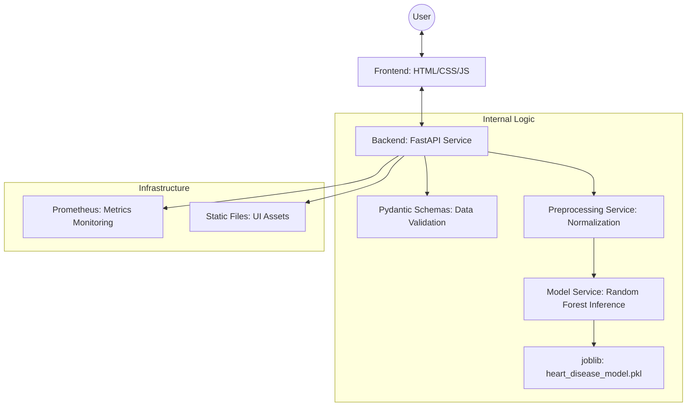
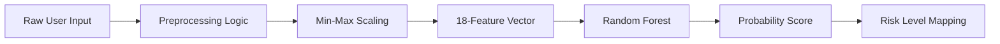

# HeartCare Risk Prediction System


An end-to-end, production-grade machine learning application designed to predict cardiovascular disease risk using advanced health analytics. This system integrates a high-performance FastAPI backend with a modern, responsive web interface, providing real-time diagnostic insights based on clinical lifestyle parameters.

---

## 📋 Table of Contents
- [Project Overview](#-project-overview)
- [System Architecture](#-system-architecture)
- [Technical Stack](#-technical-stack)
- [Project Evolution (Step-by-Step)](#-project-evolution-step-by-step)
- [File & Component Contribution](#-file--component-contribution)
- [Data Engineering & Features](#-data-engineering--features)
- [Installation & Deployment](#-installation--deployment)
- [API Documentation](#-api-documentation)
- [License & Usage](#-license--usage)

---

## 🌟 Project Overview

The **HeartCare Risk Prediction System** addresses the critical need for accessible preliminary cardiovascular screening. By leveraging a **Random Forest Classifier** trained on comprehensive health datasets, the application identifies patterns in a user's health profile (e.g., lifestyle, BMI, medical history) to estimate the probability of heart disease.

### Core Objectives
- **Accessibility**: Provide a non-invasive, quick heart health assessment tool.
- **Precision**: Utilize scikit-learn's robust ensemble learning for high-accuracy predictions.
- **Scalability**: Deployable via Docker with built-in monitoring via Prometheus.
- **Security**: Strict input validation and data sanitization using Pydantic.

---

## 🏗 System Architecture

The following diagram illustrates the data flow and interaction between various system layers:



---

## 🛠 Technical Stack

### Backend & Core
- **Language**: Python 3.9+ for its extensive data science ecosystem.
- **Framework**: **FastAPI** – High-performance, asynchronous web framework.
- **Validation**: **Pydantic v2** – Ensuring strict type checking and data integrity.
- **Serialization**: **Joblib** – Optimized for saving/loading large Scikit-learn models.

### Machine Learning
- **Model**: **Random Forest Classifier** – An ensemble technique that reduces overfitting and improves generalization.
- **Libraries**: **Scikit-learn** for modeling, **Pandas** and **NumPy** for data manipulation.

### Frontend & UI
- **Design**: Modern **Glassmorphism** aesthetic using Vanilla CSS3.
- **Logic**: Vanilla JavaScript for asynchronous API communication (Fetch API).
- **Templates**: **Jinja2** for server-side dynamic HTML rendering.

### DevOps & Infrastructure
- **Containerization**: **Docker** for environment consistency and portability.
- **Monitoring**: **Prometheus Instrumentation** for real-time API performance tracking.
- **Version Control**: Git with **LFS (Large File Storage)** for binary model assets.

---

## 🚀 Project Evolution (Step-by-Step)

The development of the HeartCare system followed a structured engineering lifecycle:

1.  **Requirement Analysis**: Identified 18 critical health parameters based on clinical relevance for cardiovascular risk.
2.  **Dataset Preparation**: Cleaned and formatted health data, handling missing values and categorical encoding.
3.  **Model Engineering**: Trained a Random Forest model, optimizing hyperparameters for the best balance between precision and recall.
4.  **Inference Layer Development**: Created the `ModelService` to handle `joblib` loading and probability-to-risk-level mapping.
5.  **API Construction**: Built RESTful endpoints using FastAPI, ensuring all inputs are validated against strict schemas.
6.  **UI/UX Implementation**: Developed a responsive frontend that guides users through a multi-step assessment form.
7.  **System Integration**: Connected the frontend `fetch` calls to the backend prediction engine.
8.  **Vulnerability & Accuracy Testing**: Implemented a testing suite to verify that UI inputs correctly map to model features.
9.  **Containerization**: Authored the `Dockerfile` and `.dockerignore` to package the app for cross-platform deployment.

---

## 📂 File & Component Contribution

| File/Directory | Role & Contribution |
| :--- | :--- |
| `app/main.py` | The **Entry Point**. Configures FastAPI, mounts static files, and initializes the application lifespan. |
| `app/api/routes.py` | **Routing Layer**. Defines API endpoints (`/predict`, `/health`) and handles request/response logic. |
| `app/services/preprocessing.py` | **Data Transformation**. Contains the logic for Min-Max scaling and categorical-to-numeric mapping. |
| `app/services/model_service.py` | **Inference Engine**. Loads the `.pkl` model and executes predictions using processed vectors. |
| `app/schemas/prediction.py` | **Data Integrity**. Defines the structure and constraints for all patient data inputs using Pydantic. |
| `app/models/` | **Storage**. Holds the serialized Random Forest model (`heart_disease_model.pkl`). |
| `app/templates/` | **View Layer**. Contains the HTML files (`index.html`, `calculate.html`) for the user interface. |
| `run_app.py` | **Utility Bootstrapper**. Simplifies local execution by checking dependencies and launching the server. |
| `Dockerfile` | **Packaging**. Instructions for building a light-weight Linux-based container for the app. |

---

## 📊 Data Engineering & Features

The system processes **18 specific features** to generate a risk assessment. Each input is normalized to a range of `[0.0, 1.0]` before being passed to the model.

### Process Workflow


### Feature Categories
- **Demographics**: Age, Sex, Height, Weight (BMI calc).
- **Lifestyle**: Smoking, Alcohol consumption, Exercise habits.
- **Nutrition**: Fruit, Green Vegetables, and Fried Potato intake.
- **Medical History**: Diabetes, Arthritis, Skin/Other Cancer, Depression status.

---

## 📥 Installation & Deployment

### Local Setup
1. **Clone & LFS**:
   ```bash
   git clone https://github.com/mohsinkp02/HeartCare-Risk-Prediction-System.git
   cd HeartCare-Risk-Prediction-System
   git lfs install && git lfs pull
   ```
2. **Execute Runner**:
   ```bash
   python run_app.py
   ```

### Docker Deployment
```bash
docker build -t heartcare-app .
docker run -p 8000:8000 heartcare-app
```

---

## 🔌 API Documentation

The system provides a fully documented RESTful API:
- **Swagger UI**: [http://localhost:8000/docs](http://localhost:8000/docs)
- **Primary Endpoint**: `POST /api/v1/predict`
  
**Example Payload:**
```json
{
  "General_Health": "Very Good",
  "Checkup": "Within 1 year",
  "Exercise": "1",
  "Diabetes": "No",
  "Age": 45,
  "BMI": 24.5
  ...
}
```

---

## 🚫 License & Usage

**Copyright © 2024 Mohsin Khan. All rights reserved.**

This repository and its contents are proprietary. No permission is granted to use, copy, modify, or distribute this code or the associated machine learning models without explicit written consent from the author.

> [!IMPORTANT]  
> This application is a clinical support tool and is **not** a substitute for professional medical diagnosis or treatment.
