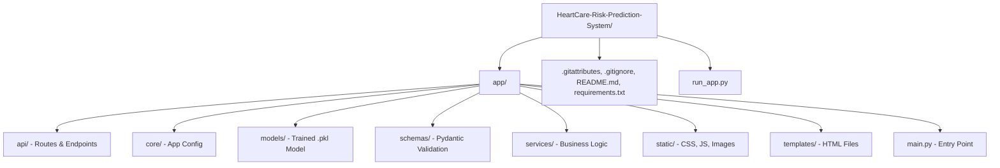

# HeartCare Risk Prediction System


An end-to-end machine learning–based web application for predicting cardiovascular disease risk using lifestyle and health attributes. This system provides a production-ready API and a modern web interface to help users assess their heart health through a series of clinically relevant questions.

---

## 📋 Table of Contents
- [Project Overview](#-project-overview)
- [Key Features](#-key-features)
- [Technology Stack](#-technology-stack)
- [Installation Instructions](#-installation-instructions)
- [Usage Guide](#-usage-guide)
- [Project Structure](#-project-structure)
- [Contribution Guidelines](#-contribution-guidelines)
- [License](#-license)

---

## 🌟 Project Overview

The **HeartCare Risk Prediction System** is designed to provide quick and accessible heart disease risk assessments. By processing variables such as age, lifestyle habits (smoking, alcohol, diet), and medical history (diabetes, checkups), the underlying machine learning model predicts the probability of heart-related complications.

### Key Capabilities
- **Real-time Prediction**: Immediate risk assessment using a trained Random Forest model.
- **Data Validation**: Strict input checking via Pydantic schemas to ensure diagnostic accuracy.
- **User-Friendly UI**: Modern, glassmorphism-inspired design for a premium user experience.
- **RESTful API**: Fully documented API endpoints for integration with other healthcare systems.

---

## 🛠 Technology Stack

| Component | Technology |
| :--- | :--- |
| **Backend Framework** | [FastAPI](https://fastapi.tiangolo.com/) |
| **Machine Learning** | [Scikit-learn](https://scikit-learn.org/) (Random Forest) |
| **Data Validation** | [Pydantic](https://docs.pydantic.dev/) |
| **Frontend** | HTML5, Vanilla CSS, JavaScript |
| **Server** | Uvicorn (ASGI) |
| **Large File Storage** | [Git LFS](https://git-lfs.com/) |

---

## 📥 Installation Instructions

### System Requirements
- **OS**: Windows 10/11, macOS, or Linux
- **Python**: 3.9 or higher
- **Disk Space**: ~500MB (including the ML model)
- **RAM**: 2GB minimum

### Step-by-Step Setup

1. **Clone the Repository** (Ensure Git LFS is installed):
   ```bash
   git clone https://github.com/mohsinkp02/HeartCare-Risk-Prediction-System.git
   cd HeartCare-Risk-Prediction-System
   ```

2. **Initialize Git LFS and Pull Model**:
   ```bash
   git lfs install
   git lfs pull
   ```

3. **Create a Virtual Environment**:
   ```bash
   # Windows
   python -m venv .venv
   .venv\Scripts\activate

   # macOS/Linux
   python3 -m venv .venv
   source .venv/bin/activate
   ```

4. **Install Dependencies**:
   ```bash
   pip install -r requirements.txt
   ```

---

## 🚀 Usage Guide

### Running the Application

To launch the web server and application, execute the runner script:

```bash
python run_app.py
```

- **Website**: Access at [http://localhost:8000](http://localhost:8000)
- **API Documentation**: Interactive Swagger docs at [http://localhost:8000/docs](http://localhost:8000/docs)

### Configuration Options

| Environment Variable | Default | Description |
| :--- | :--- | :--- |
| `APP_NAME` | HeartCare | The display name of the application |
| `API_V1_STR` | /api/v1 | The prefix for all API endpoints |
| `HOST` | 0.0.0.0 | Network interface to bind to |
| `PORT` | 8000 | Port number for the web server |

---

## 📂 Project Structure



---

## 🤝 Contribution Guidelines

We welcome contributions to HeartCare! To contribute, follow these steps:

### Reporting Issues
- Use the **GitHub Issues** tab to report bugs or request features.
- Provide a clear description and steps to reproduce the issue.

### Pull Request Process
1. Fork the repository.
2. Create a new branch (`git checkout -b feature/AmazingFeature`).
3. Commit your changes following our **Coding Standards** (PEP 8 for Python).
4. Push to the branch.
5. Open a Pull Request for review.

### Coding Standards
- Follow [PEP 8](https://peps.python.org/pep-0008/) for style.
- Include docstrings for all new functions and classes.
- Ensure all tests pass before submitting.

---

## ⚖️ License

Copyright © 2024 Mohsin Khan.

Distributed under the **MIT License**. See `LICENSE` for more information.

---

> [!NOTE]  
> This system is intended for informational purposes and should not replace professional medical advice.
